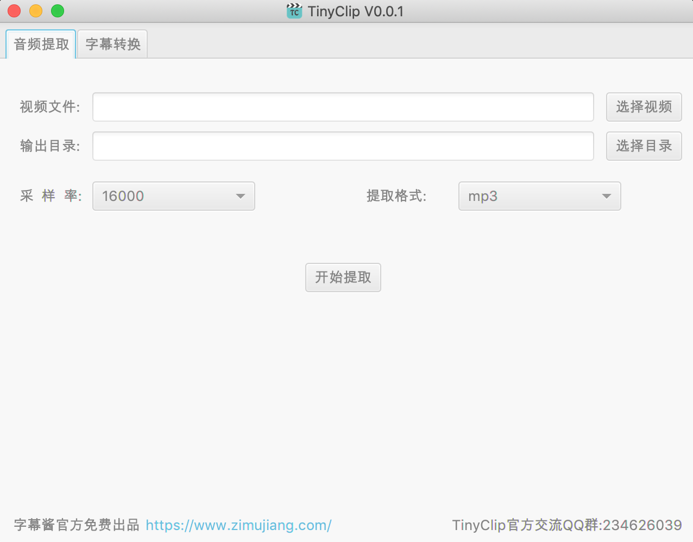

	
	<h1>TinyClip</h1>
	

		<b>基于JavaFx的全平台FFMPEG-GUI客户端</b>
	

	 

## TinyClip交流群
交流QQ群：234626039

## 已更新功能列表
* 音频提取
* 字幕格式转换（srt\ass）

## TODO
* 音视频格式转换
* 视频水印处理
* 视频裁剪拼接
* ......(欢迎加群提需求)

## 项目依赖
* dev --> JDK8+
* build --> JDK11+（支持模块化打包，减小压缩包50%+）

## 特别提醒
TinyClip目前还在开发中，使用请自行评估使用风险！

## 支持平台
* Mac
* Windows
* Linux

## 系统截图
1、音频提取

    

2、字幕格式转换

    

